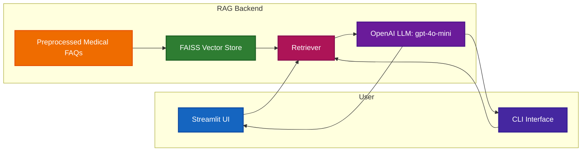
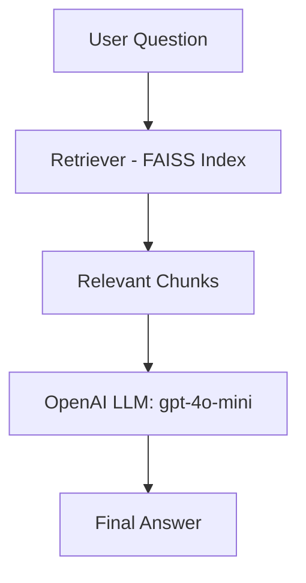

# RAG-based Medical FAQ Chatbot

- A Retrieval-Augmented Generation (RAG) chatbot designed to answer medical FAQ-style questions responsibly using a curated dataset.

- This project demonstrates how to combine FAISS, LangChain, HuggingFace embeddings, and OpenAI GPT-4o-mini into an interactive system accessible via Streamlit UI and CLI interface.

- Disclaimer: This chatbot is for informational purposes only and does not provide personal medical advice. Always consult a qualified healthcare professional for medical concerns.

## End-to-End System Architecture


## RAG Pipeline Flow


## Features
- RAG pipeline with FAISS vector store for efficient retrieval
- HuggingFace embeddings (all-MiniLM-L6-v2) for semantic search
- OpenAI GPT-4o-mini as LLM for contextual, concise answers
- Custom prompt for safe and responsible medical responses
- Streamlit Web UI with interactive chat and source visibility
- CLI interface for lightweight usage
- Caching for repeated queries to improve speed
- Data preparation notebook to combine & clean multiple CSV datasets

## Tech Stack
- Python 3.11.9
- LangChain (retrieval + chaining)
- FAISS (vector store)
- HuggingFace Embeddings (sentence-transformers/all-MiniLM-L6-v2)
- OpenAI GPT-4o-mini (LLM)
- Streamlit (UI)
- Pandas / NumPy / Scikit-learn (data processing)
- tqdm (progress tracking)
- dotenv (environment variables)

## Folder Structure:
```
medical_rag_chatbot/
│
├── data/ 
    └── train.csv                       # Data storage
│   └── me3dical_faqs_cleaned.csv       # Cleaned & combined dataset
│
├── VectorStore/medical_faq_index       # FAISS vector index storage
│   ├── index.faiss
│   └── index.pkl
│
├── notebooks/                   
│   └── data_preparation.ipynb   # Notebook for dataset merging & cleaning
│
├── src/                         # Core project source code
│   ├── embeddings.py            # Create FAISS vector store
│   ├── rag_pipeline.py          # RAG pipeline (LangChain, OpenAI, FAISS)
│   ├── streamlit_app.py         # Streamlit web app
│   └── cli_app.py               # CLI interface
│
├── .env.example                 # Example environment variables
├── requirements.txt             # Python dependencies
├── README.md                    # Project documentation
└── .gitignore                   # Ignore unnecessary files
```

## Setup Instructions
1. Clone Repository:
```
git clone https://github.com/suchijain30/RAG-based-Medical-FAQ-Chatbot.git
cd rag-based-medical-faq-chatbot
```
2. Create Virtual Environment:
```
python -m venv venv
source venv/bin/activate   # Linux/Mac
venv\Scripts\activate      # Windows
```

3. Install Dependencies:
```
pip install -r requirements.txt
```

4. Environment Variables
Create a .env file in the project root:
```
OPENAI_API_KEY=your_openai_api_key_here
```

## Data Preparation
- Run the notebook: notebooks/data_preparation.ipynb
- Loads multiple medical Q&A CSVs
- Preprossed teh data (medical_fags_cleaned)
- Saves the cleaned dataset into data/

## Create FAISS Vector Store:
```
python Source/embeddings.py
```
This will:
- Load data/processed_faqs.csv
- Split into text chunks
- Generate embeddings with HuggingFace
- Store them in FAISS under faiss_index/

## Run the RAG Chatbot
1. Streamlit UI
```
streamlit run src/streamlit_app.py
```
- Access the chatbot in your browser (default): http://localhost:8501
- Features:
  - Clean & professional UI
  - Chat history
  - Expandable retrieved source chunks
  - Clear chat button

2. CLI Interface:
```
python src/cli_app.py --show-sources
```
Sample interaction:
```
💊 MediBot – Medical FAQ CLI Chatbot
Type 'exit' or 'quit' to end the chat.

You: What are the early symptoms of diabetes?
MediBot: Early symptoms of diabetes can include thirst, frequent urination, hunger, tiredness...
Retrieved Source Chunks:
- Original Question: what are the symptoms of diabetes ? | Source ID: 2993_0
```
## Local Testing Workflow
1. Prepare dataset → notebooks/data_preparation.ipynb
2. Build FAISS index → python src/embeddings.py
3. Run chatbot:
   - Streamlit UI → streamlit run src/streamlit_app.py
   - CLI → python src/cli_app.py
4. Ask questions and verify:
   - Answers come from context only
   - Sources are traceable
   - Non-medical or unsafe queries handled responsibly

## Notes
- Caching: Frequently asked queries are cached for faster responses.
- Safety: The prompt strictly prevents giving direct medical advice.
- Extensibility: Can be extended to use other embedding models or vector DBs (like ChromaDB).
- Data: Ensure processed_faqs.csv is well-cleaned before running embeddings.
